# Optimizing an ML Pipeline in Azure

## Overview
This project is part of the Udacity Azure ML Nanodegree.
In this project, we build and optimize an Azure ML pipeline using the Python SDK and a provided Scikit-learn model.
This model is then compared to an Azure AutoML run.

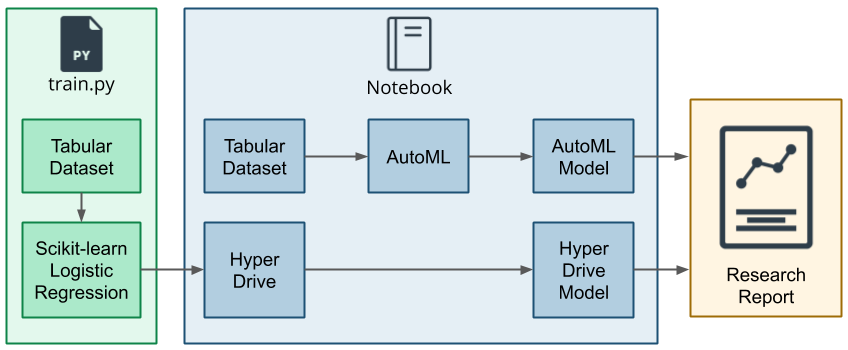

## Useful Resources
- [ScriptRunConfig Class](https://docs.microsoft.com/en-us/python/api/azureml-core/azureml.core.scriptrunconfig?view=azure-ml-py)
- [Configure and submit training runs](https://docs.microsoft.com/en-us/azure/machine-learning/how-to-set-up-training-targets)
- [HyperDriveConfig Class](https://docs.microsoft.com/en-us/python/api/azureml-train-core/azureml.train.hyperdrive.hyperdriveconfig?view=azure-ml-py)
- [How to tune hyperparamters](https://docs.microsoft.com/en-us/azure/machine-learning/how-to-tune-hyperparameters)


## Summary
Our dataset contains data about the bank marketing, so we seek to predict whether the client will subcribe to a bank term deposit.

In the project we have used the remote run for HyperDrive and AutoML

Requirement the cluster:
``` latex
name: auto-ml
size: Standard_D2_V2
min_nodes: 0
max_nodes: 4
```

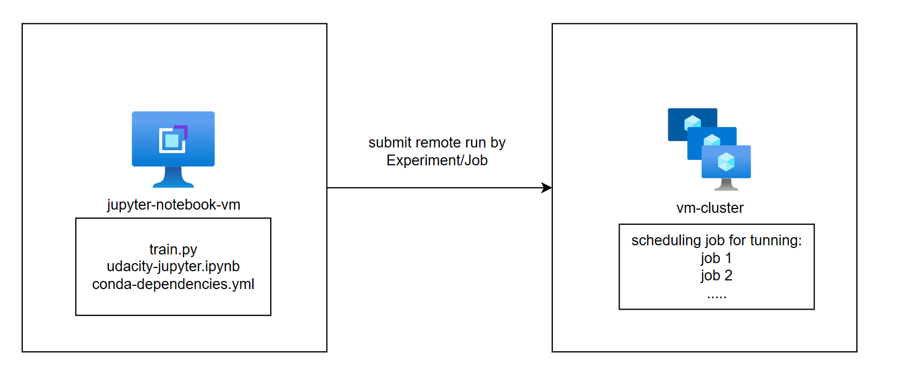

Our best model in the Scikit-learn Pipeline is **HD_2368ecef-c116-4c5b-a16d-96c3e21e30e2_22** and it gets an **acccuracy of 0.91108**

In the Azure AutoML we will have the best model is **AutoML_56cf6df5-73f8-4076-a781-d1475c8cb408_36** using VotingEnsemble algorithm and it get an **accuracy of 0.91492**

Overral, the best performing model was a Azure AutoML model using VotingEnsemble algorithm.

## Scikit-learn Pipeline
> Explain the pipeline architecture, including data, hyperparameter tuning, and classification algorithm.

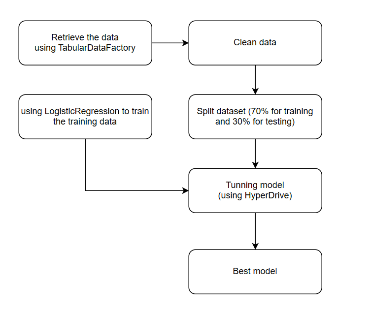

The first, we retrieve the data using the TabularDataFactory and return the tabular format.

We use the `clean_data` method to clean data for data preprocessing. Then, we split data to 70% for training and 30% for testing.

In the Scikit-lean pipeline we use the LogisticRegression algorithms to define the model.

Using the HyperDrive for tunning model, include the paramter sample and stopping policy.

> What are the benefits of the parameter sampler you chose?

For this project, I use the Bayesian sampling, which is based on the Bayesian optimization algorithm. It picks samples based on how previous samples did, so that new samples improve the primary metric, so it suitable to explore the larger search space.

> What are the benefits of the early stopping policy you chose?

For this project, I use a Bandit Policy that is based on slack factor and evaluation interval. it use for early terminate the training run to prevent experiments from running for a long time and using up the resources.

### Result
Finally, the remote run is completed, we found the best model like bellow:
``` latex
Run Id: HD_2368ecef-c116-4c5b-a16d-96c3e21e30e2_22
Accuracy: 0.9110773899848255
Regularization Strength: 10.651386568041366
Max iterations: 220
```
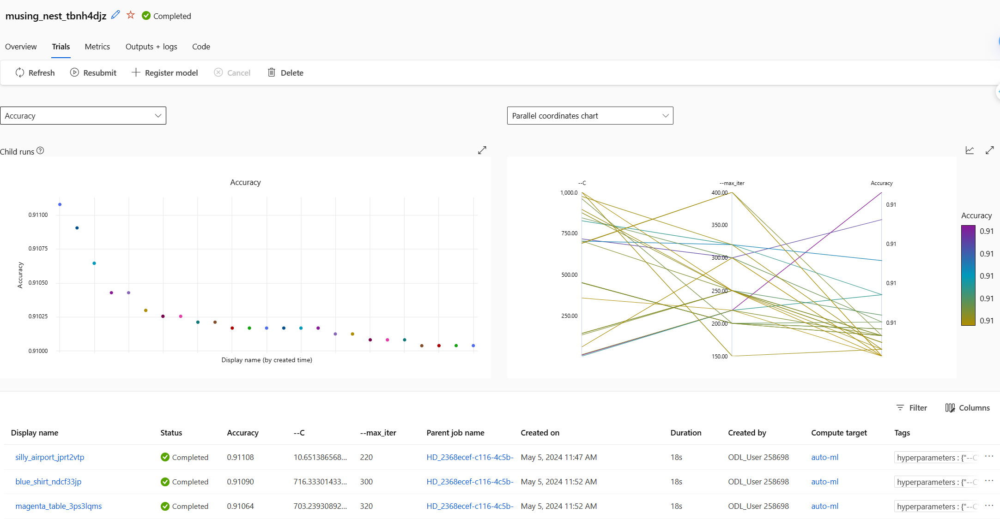
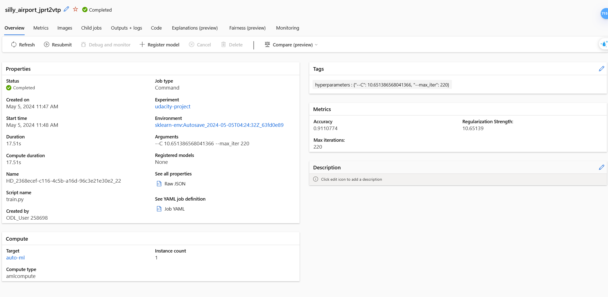

## AutoML
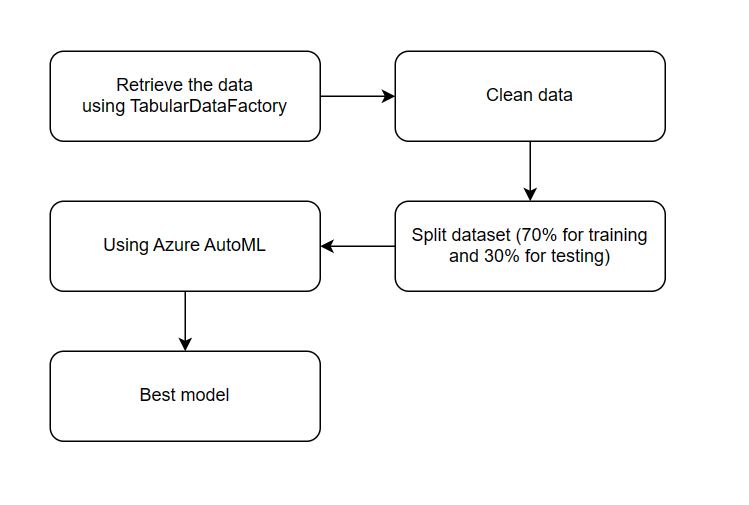

Like the Scikit-learn Pipeline proccessing, we use the AutoML to find the best Model among various algorithms to fit the dataset.

Azure AutoML tried difference algorithms such as: MaxAbsScaler SGD, gisticRegression,RandomForest,
XGBoostClassifier, ...

the parameter I set in AutoMLConfig:

`task`: type of task to run.

`primary_metric`: the metric that AutoML will optimize for model.

`compute_target`: to remote run the AutoML experiments on

`max_concurrent_iterations`: Represents the maximum number of iterations that would be executed in paralle

`training_data`: the training data to be used for a training model

`test_data`: the test data to be used for a test run.

`label_column_name`: The name of the label column. 

### Result
After the AutoML remote run is completed, we found the best model like bellow
``` latex
Algorithm: VotingEnsemble
Accuracy: 0.91492
AUC macro: 0.94162
AUC micro: 0.97883
AUC weighted: 0.94162
```   
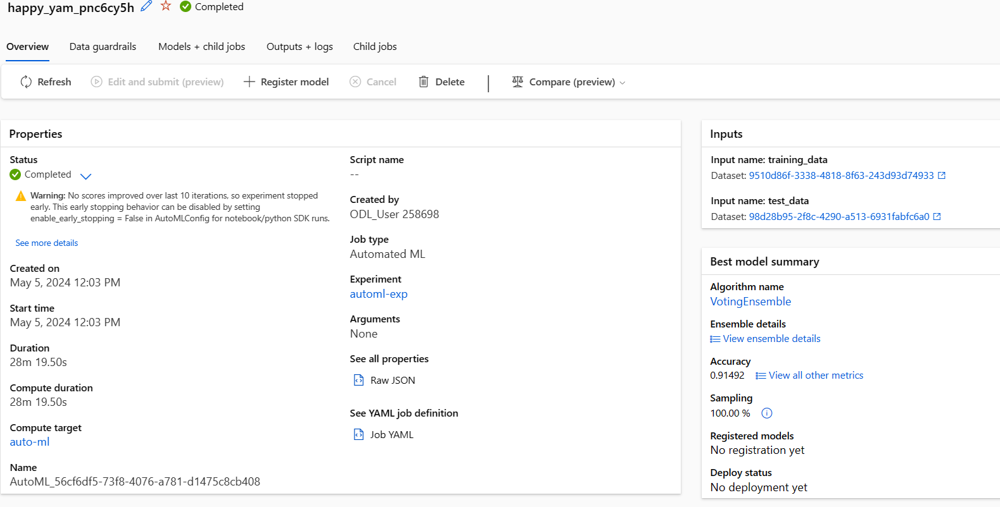

Top Feature:

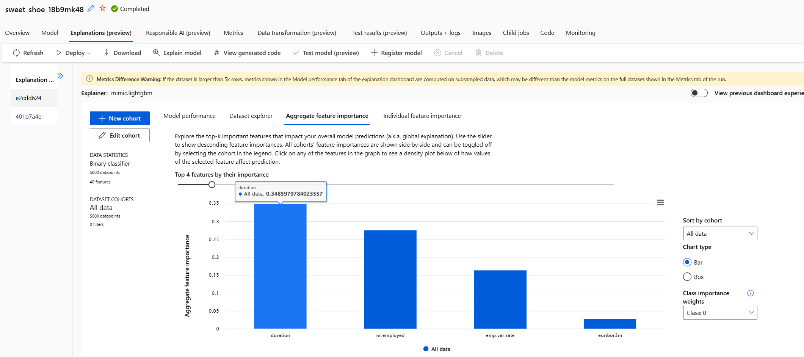

Metric:

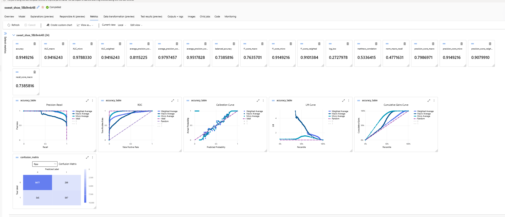

## Pipeline comparison
Overral, the accuracy difference between the two Pipelines is not significant. The best model in the Scikit-learn Pipeline gets an **acccuracy of 0.91108**. In the Azure AutoML, the best model using the VotingEnsemble algorithm achieves an **accuracy of 0.91492**. 

**The AutoML** is suitable for testing dataset with difference algorithms when we don't know which the  algorithms is best suited for the dataset.

If we alredy know the algorithm that is suitable for the dataset, **The HyperDrive** is sutable for finding the best parameter space for model within the search space during tunning.

## Future work
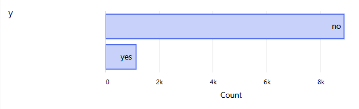

The dataset is imbalance, this is huge problem in classification because it impact the model accuracy negatively. So we will collect more yes sample to make the dataset is balance.

I'll try other parameter samplers to compare the  Bayesian sampling, such as Grid Sampling, Random Sampling and others.

## Proof of cluster clean up
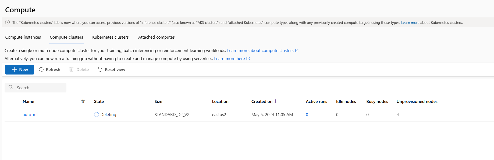

## Reference
- https://learn.microsoft.com/en-us/AZURE/machine-learning/how-to-tune-hyperparameters?view=azureml-api-1
- https://learn.microsoft.com/en-us/python/api/azureml-train-automl-client/azureml.train.automl.automlconfig.automlconfig?view=azure-ml-py
